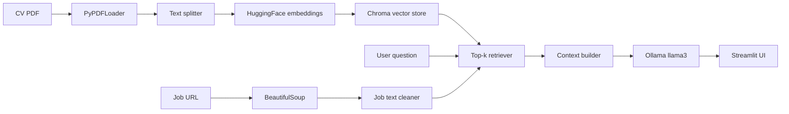

# CV RAG Assistant

A local Streamlit app that turns your CV (PDF) into a searchable knowledge base and helps you explore it with natural-language questions and job-posting match analysis. Retrieval-augmented generation (RAG) keeps answers grounded in your actual resume content.

## Features

- **PDF ingestion** — Upload a CV PDF; pages are loaded and split into overlapping chunks for retrieval.
- **CV chat** — Ask questions about your experience, skills, and roles; answers use only retrieved CV context.
- **Job match analysis** — Paste a job posting URL; the app fetches and cleans the page text, retrieves relevant CV sections, and generates a structured match report (score, strengths, gaps, recommendations).
- **Debug previews** — Expandable views of raw PDF text and sample chunks.

## How it works



1. **Ingest** — `PyPDFLoader` reads the uploaded PDF.
2. **Chunk** — `RecursiveCharacterTextSplitter` (500 chars, 50 overlap) splits documents.
3. **Embed & store** — `sentence-transformers/all-MiniLM-L6-v2` embeddings are stored in a local Chroma DB (`./vector_store`).
4. **Retrieve** — Similarity search returns the top 3 chunks for a question or job description.
5. **Generate** — [Ollama](https://ollama.com/) (`llama3`) produces chat answers or a recruiter-style job match report.

## Prerequisites

- **Python 3.10+** (3.14 works with the pinned dependencies in this repo)
- **[Ollama](https://ollama.com/)** running locally with the `llama3` model:

  ```bash
  ollama pull llama3
  ```

- Enough disk/RAM for Hugging Face embeddings and PyTorch (first run downloads the embedding model)

## Installation

```bash
git clone <your-repo-url>
cd cv-rag-assistant

python -m venv venv
source venv/bin/activate   # Windows: venv\Scripts\activate

pip install -r requirements.txt
```

## Usage

Start the app:

```bash
streamlit run app.py
```

Then in the browser:

1. **Upload your CV** (PDF) under **CV Upload**.
2. Wait for processing (chunk count and vector DB creation messages).
3. **Chat With Your CV** — type a question and read the grounded answer.
4. **Job Match Analysis** — enter a public job posting URL and click **Analyze Job**.

Uploaded files are saved under `data/uploads/`. The vector index is persisted under `vector_store/` (both are gitignored).

## Project structure

```
cv-rag-assistant/
├── app.py                 # Streamlit UI
├── requirements.txt
├── src/
│   ├── ingest.py          # PDF loading
│   ├── chunking.py        # Document splitting
│   ├── embeddings.py      # HuggingFace embeddings
│   ├── vector_store.py    # Chroma persistence
│   ├── retriever.py       # Top-k similarity search
│   ├── rag.py             # Context assembly
│   ├── llm.py             # Ollama chat model
│   ├── job_extractor.py   # Job page scraping
│   ├── job_cleaner.py     # Noise filtering on job text
│   └── job_match.py       # Job match prompt template
├── data/uploads/          # Uploaded PDFs (created at runtime)
└── vector_store/          # Chroma index (created at runtime)
```

## Configuration

| Component   | Location              | Default                                      |
|------------|------------------------|----------------------------------------------|
| LLM        | `src/llm.py`           | `llama3`, temperature `0`                    |
| Embeddings | `src/embeddings.py`    | `sentence-transformers/all-MiniLM-L6-v2`     |
| Chunking   | `src/chunking.py`      | size `500`, overlap `50`                     |
| Retrieval  | `src/retriever.py`     | `k = 3`                                      |

Change the Ollama model in `get_llm()` if you use a different local model.

## Limitations

- Processing runs **per upload** in the current session flow; re-uploading rebuilds the index.
- Job extraction depends on **public HTML** pages; heavily JavaScript-rendered or login-walled postings may fail or return poor text.
- Match scores and assessments are **LLM-generated suggestions**, not hiring decisions.
- CV data stays **on your machine** (local embeddings + local Ollama); job URLs are fetched over the network.

## Tech stack

- [Streamlit](https://streamlit.io/) — UI
- [LangChain](https://www.langchain.com/) — loaders, splitters, retriever, Ollama integration
- [Chroma](https://www.trychroma.com/) — vector store
- [Hugging Face Sentence Transformers](https://www.sbert.net/) — embeddings
- [Ollama](https://ollama.com/) — local LLM
- [BeautifulSoup](https://www.crummy.com/software/BeautifulSoup/) — job page text extraction
